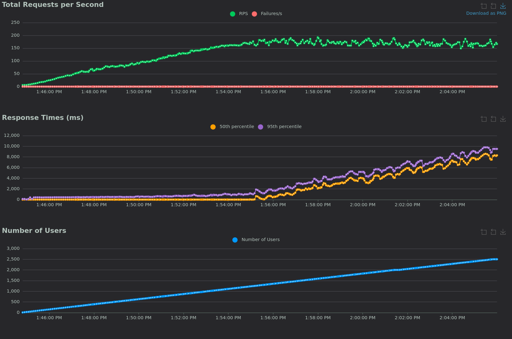
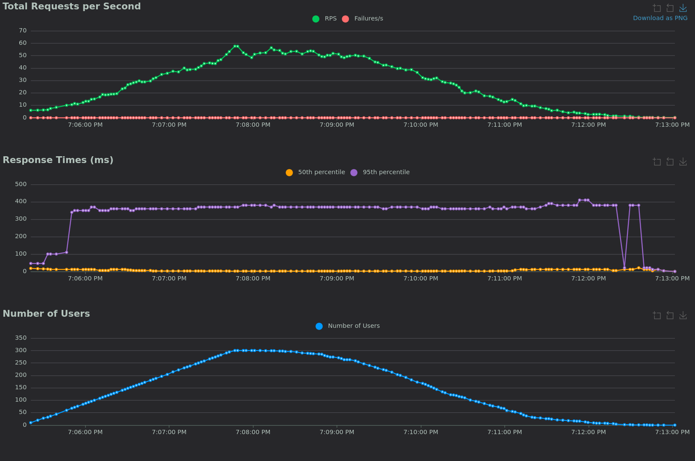

# Fletcher Load Testing Results

## Test Environment

- **OS**: Fedora Linux 42 x86_64
- **Kernel**: Linux 6.15.8-200.fc42.x86_64
- **CPU**: AMD Ryzen 9 7950X (32 cores) @ 5.88 GHz
- **Storage**: 2TB NVMe Gen 4 SSD (Sabrent)
- **Filesystem**: btrfs
- **Docker Image Size**: 31.7MB

## Busiest Day Test Results

**Test Configuration**: 300 users, single run mode

- **Fletcher RAM Usage**: 28MB
- **PostgreSQL RAM Usage**: 1.2GB
- **Execution Time**: 8m3s
- **Errors**: None
- **Status**: ✅ Successful completion

## Stress Test Results

### Default Configuration (10 PostgreSQL Connections)

**Limitations**: PostgreSQL connection pool becomes the primary bottleneck.

- **MAX_CONNECTIONS**: 10 (default)
- **Fletcher Memory Usage**: 275MB
  - Increased memory due to request queuing while waiting for database responses
  - More PostgreSQL connections reduce Fletcher's memory pressure by pushing
    load to the database
- **Fletcher CPU Usage**: 13% of 1 core
- **Performance Characteristics**:
  - **Optimal Performance Threshold**: 950 concurrent users
  - **Peak Requests/Second**: 140 (without performance degradation)
  - **Failure Threshold**: 2,500+ users (10s median response time)
  - **Primary Bottleneck**: PostgreSQL CPU utilization

### Optimized Configuration (30 PostgreSQL Connections)

**Improvements**: Increased connection pool reduces database bottleneck.

- **MAX_CONNECTIONS**: 30 (3x increase)
- **Fletcher Memory Usage**: 160MB (42% reduction)
- **Fletcher CPU Usage**: 20% of 1 core
- **Performance Characteristics**:
  - **Optimal Performance Threshold**: 1,300 concurrent users (+37% improvement)
  - **Peak Requests/Second**: 180 (+29% improvement)
  - **Failure Threshold**: 2,500+ users (8s median response time)
  - **Primary Bottleneck**: PostgreSQL CPU utilization

### Performance Comparison

| Metric                   | 10 Connections | 30 Connections | Improvement |
|--------------------------|---------------:|---------------:|------------:|
| Optimal Users            | 950            | 1,300          | +37%        |
| Peak RPS                 | 140            | 180            | +29%        |
| Fletcher Memory          | 275MB          | 160MB          | -42%        |
| Fletcher CPU             | 13%            | 20%            | +54%        |

## Performance Analysis

### Key Findings

1. **Database-Bound Performance**: PostgreSQL CPU utilization is the primary
   limiting factor across all test configurations
2. **Connection Pool Impact**: Increasing PostgreSQL connections from 10 to 30
   provides significant but diminishing returns
3. **Memory Efficiency**: Higher connection counts reduce Fletcher's memory
   pressure by distributing load to the database
4. **Scalability Ceiling**: Even with optimal configuration, performance
   plateaus due to database constraints

### Architectural Considerations

- **Transaction Safety**: Using connection pooling with transactions maintains
  data integrity under load
- **Raw Connection Trade-offs**: While raw PostgreSQL connections could
  theoretically improve performance, they introduce unacceptable data integrity
  risks during high-load scenarios

## Recommendations

1. **Production Configuration**: Use `MAX_CONNECTIONS=30` for optimal performance
2. **Capacity Planning**: Plan for ~1,000-1,300 concurrent users with current architecture
3. **Monitoring**: Focus on PostgreSQL CPU and connection utilization as key metrics
4. **Future Optimization**: Consider database resource scaling for higher loads

## Test Methodology

- **Tool**: Locust load testing framework
- **Scenarios**: Realistic Fletcher API workflows (authentication, plan creation,
  state updates)
- **Measurement**: Response times, error rates, resource utilization
- **Environment**: Local PostgreSQL instance for maximum performance baseline

## Interactive Reports and Data

### HTML Reports

Comprehensive interactive reports with detailed charts and statistics:

- **[Stress Test (30 Connections)](stress_30_connections/stress_test_30_connections.html)**
  - Optimized configuration with 1,300 user capacity
- **[Stress Test (10 Connections)](stress_10_connections/stress_test_10_connections.html)**
  - Default configuration with 950 user capacity
- **[Busiest Day Test](busiest_day/busiest_day_test.html)**
  - Production load simulation (300 users, 8m3s runtime)

### Performance Charts

Request rate visualizations over time:

*30 Connections: Optimal configuration achieving 180 RPS with 1,300 user capacity*

*10 Connections: Default configuration achieving 140 RPS with 950 user capacity*

*Busiest Day: 300 users representing peak daily load (8m3s runtime)*

### Raw Data

CSV files with detailed request logs for analysis:

- **[30 Connections Data](stress_30_connections/stress_test_30_connections_requests.csv)**
  (1.9MB)
- **[10 Connections Data](stress_10_connections/stress_test_10_connections_requests.csv)**
  (2.0MB)
- **[Busiest Day Data](busiest_day/busiest_day_test_requests.csv)**
  (173KB)
